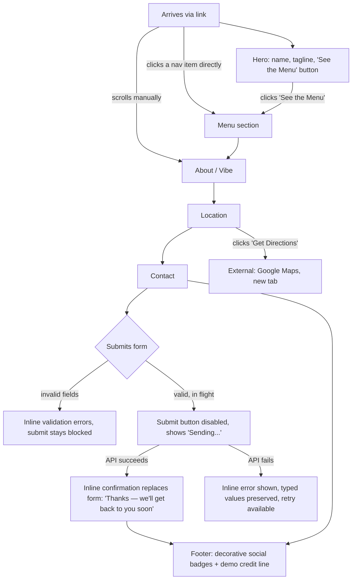

# User flows — Pahinga Coffee spec page

## User type

Single type: **Prospect** — a Manila small-business owner evaluating the
developer's portfolio work, arriving via a cold-call follow-up message
or a link (not organic search discovery). No auth, no multi-user, no
permissions model — this is a public, static marketing page.

## Screens / sections

This is one continuous scrolling page, not a multi-screen app. The
"screens" are its sections, each with its own anchor id:

1. **Hero**
2. **Menu**
3. **About / Vibe**
4. **Location**
5. **Contact**

Plus persistent chrome: a sticky **Nav** (top) and a **Footer** (bottom).

## Navigation convention

Sticky top nav with links: Menu / About / Location / Contact. Clicking a
link smooth-scrolls to that section. The active nav item is highlighted
via scroll-spy (`IntersectionObserver`) as the user scrolls, so the page
always shows "where you are" — recognition over recall.

## Auth gates

None. Public page, no login, no gated content.

## Overall flow

## Section-by-section detail

### Hero
- Content: Pahinga Coffee name/logo, one-line vibe tagline, a **"See the
  Menu"** button.
- Primary action: the button smooth-scrolls to the Menu section — the
  one obvious next step for a first-time visitor.
- No loading/error/empty states — fully static.

### Menu
- Category tabs: Espresso & Coffee Classics (**default/active on
  load**), Local Signatures & Specialty Lattes, Tea/Refreshers &
  Non-Coffee, Add-Ons & Customizations, Pastries & Bakes.
- Interaction: clicking a tab swaps the visible item list instantly —
  client-side state only, no fetch, no reload.
- No empty state (every category has authored items) and no loading
  state (no network call involved).

### About / Vibe
- Static content — the cozy/dim/woody/library-vibe story. No
  interaction beyond scrolling past it.

### Location
- Google Maps iframe embed (generic Taft Avenue, Manila pin, near De La
  Salle University), address text, hours.
- A real **"Get Directions"** link opens Google Maps in a new tab for
  that same generic area — harmless, since it points at a real
  neighborhood, not a claimed real building.
- No auth/loading/error states — static embed.

### Contact — the one real functional mechanism on the page
- Fields: name, email/phone, message — all required; submit stays
  disabled until every field is filled.
- **Submitting:** button becomes disabled and shows "Sending..." to
  prevent a double-submit while the Web3Forms request is in flight.
- **Success:** an inline confirmation replaces the form —
  "Thanks — we'll get back to you soon."
- **Failure** (network/API error): an inline error message appears, and
  every value the user typed is preserved, never wiped — they can fix
  and retry without retyping everything.
- **Validation failure** (empty/invalid fields): inline per-field
  errors, submit stays blocked.
- Every other interactive-*looking* element on the page (the social
  badges) is explicitly decorative — this form is the only one that
  actually does something, and it's the only place a real error/loading
  state needs to exist.

### Footer
- Decorative, non-functional social/channel badges (Messenger/IG/
  Grab-style) — signal local-market awareness, not real links.
- A small demo-disclosure credit line (e.g. "A concept landing page
  design — [developer]'s portfolio"). **Exact wording and the link
  target are deferred** — the portfolio site this eventually points to
  doesn't exist yet (out of scope for this repo per `docs/PRD.md`'s
  scope note). Flag this as an open loose end when the portfolio site
  is built.

## UX floor check

- **One obvious primary action per screen:** Hero → "See the Menu";
  Menu → pick a category; Contact → submit the form. Holds.
- **Nothing requires recalling info from an earlier section** — the nav
  highlight always shows current position. Holds.
- **Step count:** a single continuous scroll, not a multi-step flow —
  no screens to collapse.
- **Progressive disclosure:** the Menu shows one category's items at a
  time rather than the full list at once, keeping it scannable instead
  of overwhelming.
- **Error / empty / loading states designed, not just the happy path:**
  the Contact form covers all three explicitly (validation error,
  submit-in-flight, API failure). Hero/Menu/About/Location have no real
  error surface to design, since they're static content.
